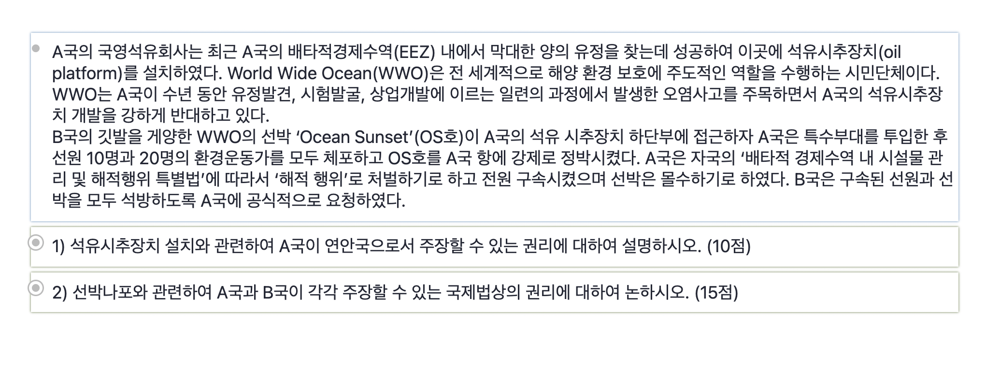

Situation & ExamQ
=================
A custom CSS to add boxshadow on rems with certain tags.

## Import
  ``@import URL ("https://github.com/justyun0/remnote-css/blob/main/situationExamQ.css");``
  
## Features
* create colored box shadow on rems with ```#Situation``` and ```#ExamQ```
* hide tags unless the rem is zoomed in
